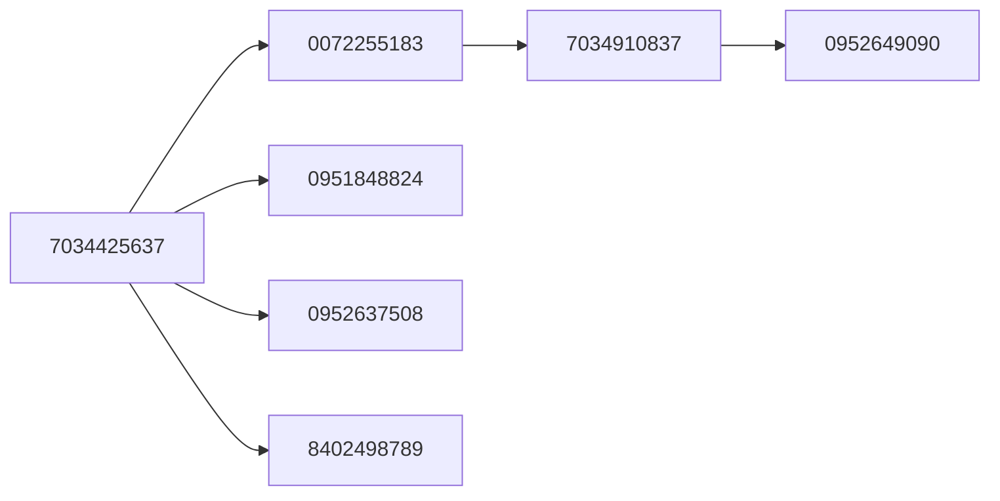

## Sumário
- [Cores](#cores)
	- [Cores Principais](#cores-principais)
	- [Cores Opcionais](#cores-opcionais)
- [Fontes](#fontes)
- [Texturas](#texturas)

# Cores

### Cores Principais

| # | Cor | Código |
|---|-----|--------|
| 1 |  | #8aa38e |
| 2 |  | #f2f3ee |
| 3 |  | #d8ab98 |
| 4 |  | #E5C9BC |

### Cores Opcionais

| # | Cor | Código |
|---|-----|--------|
| 1 |  | #00B7B7 |
| 2 |  | #029999 |
| 3 |  | #17C4B9 |
| 4 |  | #774692 |
| 5 |  | #D0618B |
| 6 |  | #EB8EB6 |
| 7 |  | #F8E491 |
| 8 |  | #FFBD59 |
| 9 |  | #F2D4BC |
| 10 |  | #4789AF |

----
# Fontes

**fontes para capa:**
- sifonn
- Pony Club
- Monteserrat Light

**fontes para conteúdo:**
- CMU Serif
- Bree Serif
- Alice

| # | Fonte | Nome |
|---|---|---|
| 1 |  | CMU Serif |
| 2 | | Bree Serif |
| 3 |  | Pony Club |
| 4 |  | Monteserrat Light |
| 5 |  | Alice |
| 6 |  | Sifonn (essa fonte não padrão do canva, precisa copiar de outro projeto ou encontrar em "text") |

----
# Texturas

| # | Imagem | Nome |
|---|----|----|
| 1 |  | Crumpled paper |

